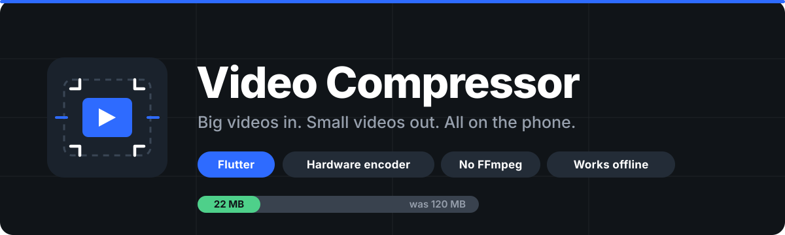
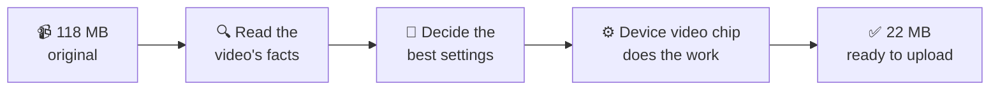
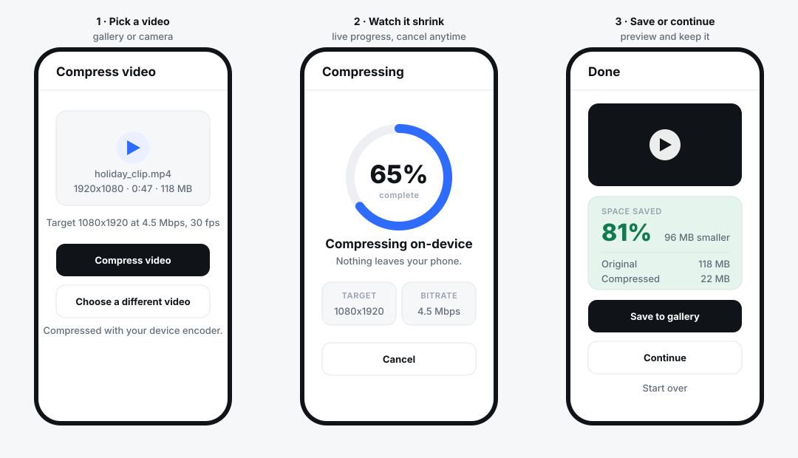
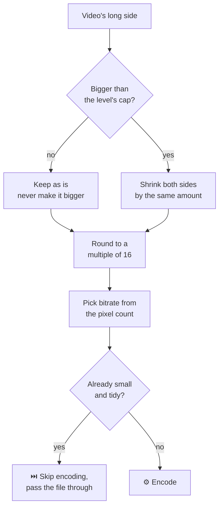
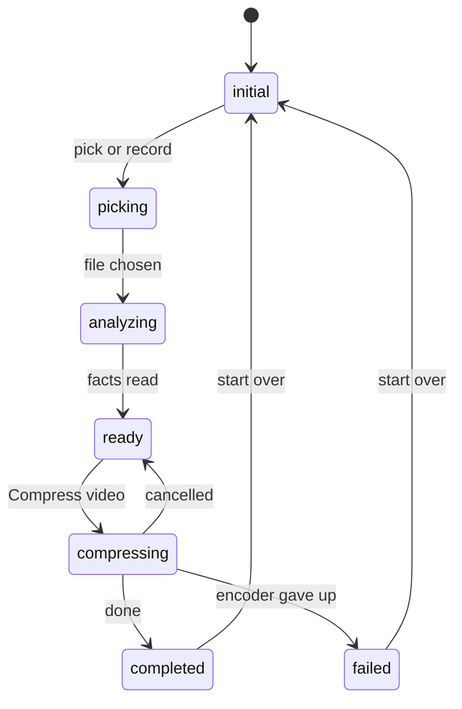

<p align="center">
  
</p>

<p align="center">
  <b>A Flutter app that makes big videos small — right on the phone, in seconds, with no internet.</b>
</p>

<p align="center">
  
  
  
  
  
</p>

---

## 🎯 The problem we are solving

Phone cameras record beautiful video and **enormous files**. That one habit breaks a lot of things:

| The pain | What it looks like in real life |
|---|---|
| 📦 **Files are huge** | A 1 minute 4K clip can be 200 MB+ |
| 🐌 **Uploads crawl** | On mobile data the upload times out, and the user gives up |
| 💸 **Data and storage burn** | Users pay for the megabytes, and so does your server bill |
| ☁️ **Privacy worry** | "Compress in the cloud" means the user's private video leaves their phone |
| 🔥 **Old tools are dead ends** | `ffmpeg_kit_flutter` is retired, and it is slow and adds tens of MB to your app |

## ✅ How we solve it

We compress the video **on the phone, before it is ever uploaded**, using the video chip
that is already inside the device.



**In simple words, five things:**

1. **🧠 It thinks first.** We read the video's real size, length and bitrate, then pick settings that fit *that* video. No fixed "one setting for everything".
2. **⚡ The phone's own video chip does the work.** Media3 on Android, AVFoundation on iOS. Fast, gentle on battery, and it adds **nothing** to your app size.
3. **🔒 Nothing leaves the phone.** No server, no upload, no account. It works in aeroplane mode.
4. **🙅 It knows when to do nothing.** A video that is already small and tidy is handed back untouched, so quality is never thrown away for a pointless 2% saving.
5. **🛡️ It never damages your original.** Your file is only ever read. Half-finished output is deleted on failure or cancel.

---

## 📱 The app in three screens

<p align="center">
  
</p>

| Screen | What the user does | What they always see |
|---|---|---|
| **1. Pick** | Choose from gallery or record a new clip | The thumbnail, size, length, and exactly what the output will be |
| **2. Compress** | Wait, or cancel | Live percentage, target resolution, target bitrate |
| **3. Done** | Play it, save to gallery, or continue to upload | Original vs. compressed size and the percentage saved |

Every screen shows its loading, empty and error state. Nothing ever fails silently.

---

## 🧠 The clever part: how settings are chosen

This is pure maths in `lib/services/video/src/compression_planner.dart` — no plugins, so it
is instant and easy to check.



**Bitrate ladder** — a bigger picture needs more bits to still look good:

| Picture size | Bitrate |
|---|---|
| up to 720p | 2.5 Mbps |
| up to 1080p | 4.5 Mbps |
| above 1080p | 6 Mbps |

Audio is always AAC 128 kbps · frame rate is capped at 30 fps · video is H.264.

**Four squeeze levels.** The level sets the size cap and multiplies the bitrate above:

```
light     ████████████████████  1080px   1.3x   best picture, modest saving
balanced  ███████████████       1080px   1.0x   ← default
strong    █████████              720px   0.6x   good for sharing
extreme   ██████                 480px   0.4x   smallest file
```

> **Why round to 16 pixels?** Video chips work in blocks of 16. Sizes that do not fit can
> come out with green edges or fuzzy bars. Rounding up could break the cap, so we step one
> block **down** instead.

---

## 🚀 Run it

```bash
flutter pub get
flutter run
```

That is all. No API keys, no backend, no native setup by hand.

---

## 🧩 How the code is laid out

Clean architecture, feature first. Plugins live **only** in the `data` layer — a widget or a
BLoC never imports one.

```
lib/
├── core/                     theme, DI, errors, shared widgets
├── features/
│   └── video_compression/
│       ├── domain/           pure Dart: entities + repository interfaces
│       ├── data/             the plugin wrappers live here, and only here
│       └── presentation/     BLoC + the 3 screens + widgets
├── services/video/           ⭐ the compression engine, standalone
└── main.dart
```

### ⭐ `services/video` is copy-paste portable

It imports **nothing else in this app**. Drop the folder into any Flutter project and it works:

```dart
import 'services/video/video_service.dart';

final result = await VideoService().compress(
  File(path),
  level: CompressionLevel.balanced,
);
```

Its full API — `compress`, `inspect`, `plan`, `extractFrames`, `progress`, `cancel` — is
documented in **[lib/services/README.md](lib/services/README.md)**.

### State flow



---

## 📦 What we depend on

| Package | Why it is here |
|---|---|
| [`v_video_compressor`](https://pub.dev/packages/v_video_compressor) | Talks to the device video chip. The only compression dependency. |
| [`image_picker`](https://pub.dev/packages/image_picker) | Pick from gallery or record a clip |
| [`video_player`](https://pub.dev/packages/video_player) | Preview the result |
| [`gal`](https://pub.dev/packages/gal) | Save to the device gallery, permissions included |
| [`permission_handler`](https://pub.dev/packages/permission_handler) | Camera and microphone for recording |
| [`flutter_bloc`](https://pub.dev/packages/flutter_bloc) + [`equatable`](https://pub.dev/packages/equatable) | State management |
| [`get_it`](https://pub.dev/packages/get_it) | Dependency injection |

**No FFmpeg.** `ffmpeg_kit_flutter` is retired and deliberately not used.

---

## 🔒 Promises the app always keeps

| | Rule |
|---|---|
| 🔐 | Your video **never** leaves the device |
| 🚫 | Never makes a video **bigger** than it started |
| 🚫 | Never squeezes an already small, tidy video a second time |
| ✂️ | Never shortens a clip — the whole video is kept |
| 🗑️ | Deletes half-finished files on failure and on cancel |
| 🛡️ | Never deletes or edits your original file |

---

## 👤 Contributors

- **kurbanalim-webelight** — author and maintainer
