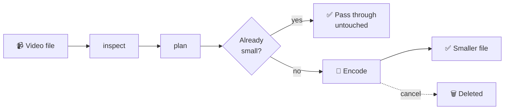
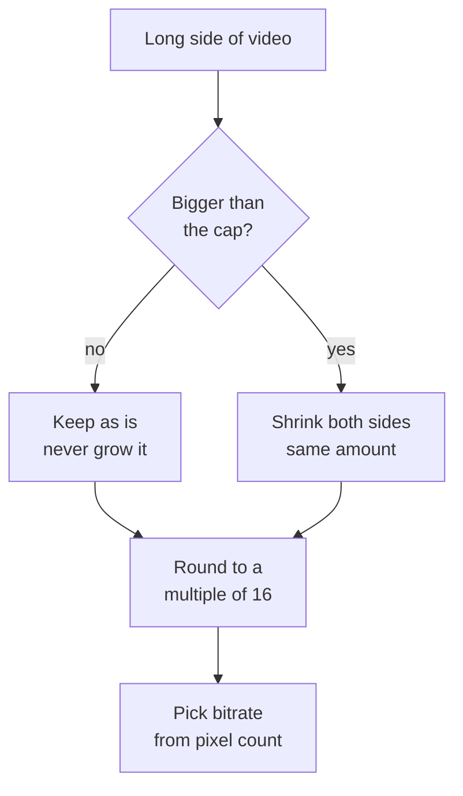

# 🎬 Video Service

Big video in → small video out, using the phone's own video chip.

A self-contained module. It imports **nothing else in this app**, so you can copy the
folder into another project and it will work.

```dart
import 'services/video/video_service.dart';

final result = await VideoService().compress(File(path), level: CompressionLevel.balanced);
```

---

## Depends on

| Package | Version | Why |
|---|---|---|
| [`v_video_compressor`](https://pub.dev/packages/v_video_compressor) | `^2.2.1` | The only outside package. Talks to the native encoder, reads video info, pulls thumbnails, reports progress. |
| `dart:io` | SDK | Reading files, writing output to the temp folder. |
| `dart:developer` | SDK | Logging. No `print`. |
| `dart:math` | SDK | The sizing maths. |

**No FFmpeg.** `ffmpeg_kit_flutter` is retired and is not used. All encoding runs on the
phone's hardware encoder — **Media3** on Android, **AVFoundation** on iOS. That means it is
fast, uses little battery, and adds nothing to your app size.

**Platform floor:** Android 5.0 (API 21) · iOS 12.

---

## The flow



---

## Methods

### `compress(file, {level})` → `Future<CompressionResult>`

**The one you will use.** Does the whole job end to end: reads the video, decides the
settings, and encodes it.

Pass `level` to say how hard to squeeze. The whole clip is always kept, however long
it is.

If the clip is already small and tidy, it is handed back untouched instead of being
squeezed again.

---

### `inspect(file)` → `Future<VideoDetails?>`

Reads a video's width, height, length and file size **without changing it**.

Use it to show file details before the user commits to anything.
Returns `null` if the file is missing, is not a video, or is broken — always null-check.

---

### `plan(details, {level})` → `CompressionSettings`

Works out **what the output will be**, before any encoding starts: target size, bitrate,
frame rate, and whether encoding will be skipped.

Pure maths, so it is instant and safe to call on every slider move. Use it to show the
user what they are about to get.

---

### `compressWith(file, settings)` → `Future<CompressionResult>`

Like `compress`, but you hand it settings you already made with `plan`.

Use this when you showed the user those exact numbers, so the result matches the promise.

---

### `extractFrames(file, positions)` → `Future<List<VideoFrame>>`

Pulls still pictures out of the video at the times you ask for.

For thumbnails and preview strips. Returns an empty list if frames cannot be read, so it
never throws.

---

### `progress` → `Stream<double>`

Goes `0.0` → `1.0` while a job runs. Wire it to a progress bar. Silent when idle.

---

### `cancel()` → `Future<void>`

Stops the running job. The half-written file is deleted for you, and the waiting
`compress` call comes back as `CompressionErrorType.cancelled`.

---

## Levels

How hard to squeeze. Each one sets a size cap and a bitrate multiplier.

```
light     ████████████████████  1080px   1.3x   best picture, modest saving
balanced  ███████████████       1080px   1.0x   ← default
strong    █████████              720px   0.6x   good for sharing
extreme   ██████                 480px   0.4x   smallest file
```

---

## How the output size is chosen



**Why 16?** Video chips work in blocks of 16 pixels. Odd sizes give green edges and fuzzy
bars. Rounding to the nearest 16 can go over the cap, so we step one block **down** instead.

**Bitrate ladder** — a bigger picture needs more bits to look good:

| Picture size | Bitrate |
|---|---|
| up to 720p | 2.5 Mbps |
| up to 1080p | 4.5 Mbps |
| above that | 6 Mbps |

That number is then multiplied by the level. Audio is always AAC 128 kbps, video is H.264.

---

## Reading the result

```dart
switch (result) {
  case CompressionSucceeded(:final output):
    output.path;                 // the new file
    output.compressedSizeBytes;  // compare with output.originalSizeBytes
    output.skipped;              // true = original returned, nothing was done

  case CompressionFailed(:final type):
    // unreadableSource → file missing, not a video, or broken
    // encodingFailed   → the encoder gave up part way
    // cancelled        → someone called cancel()
}
```

---

## Rules it always follows

| | Rule |
|---|---|
| 🚫 | Never makes a video **bigger** than it started |
| 🚫 | Never squeezes an already small, tidy video a second time |
| ✂️ | Never shortens a clip — the whole video is kept |
| 🗑️ | Deletes half-finished files on failure and on cancel |
| 🔒 | Never deletes or edits your original file |

---

## Files

```
services/video/
├── video_service.dart          ← import this one
└── src/
    ├── video_service.dart       does the work, talks to the plugin
    ├── compression_planner.dart the sizing and bitrate maths, no plugins
    ├── compression_level.dart   the 4 levels
    └── models.dart              the data types
```

`compression_planner.dart` is plain Dart with no plugin, so the decisions it makes can be
read and checked on their own.
